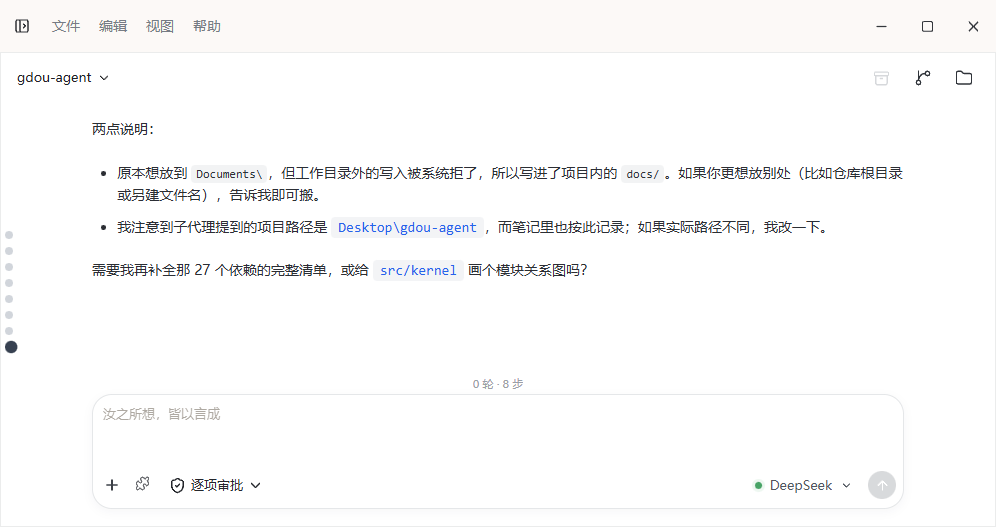
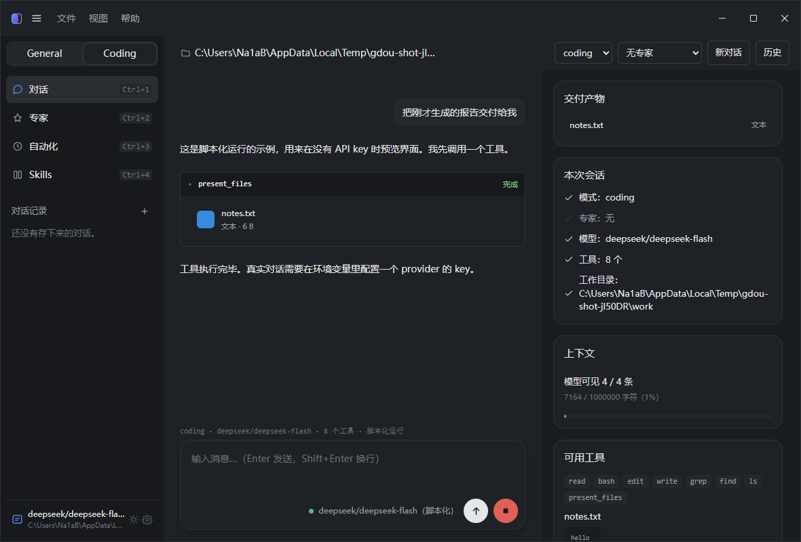
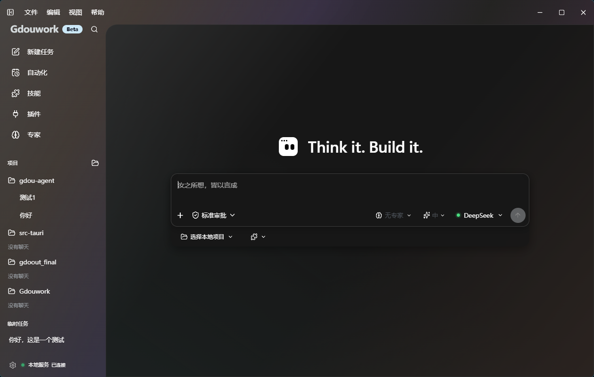
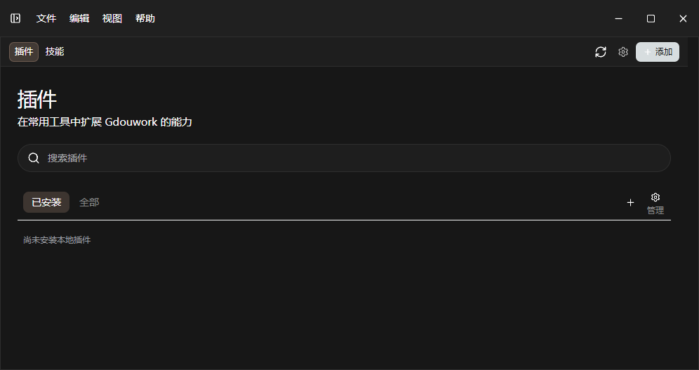
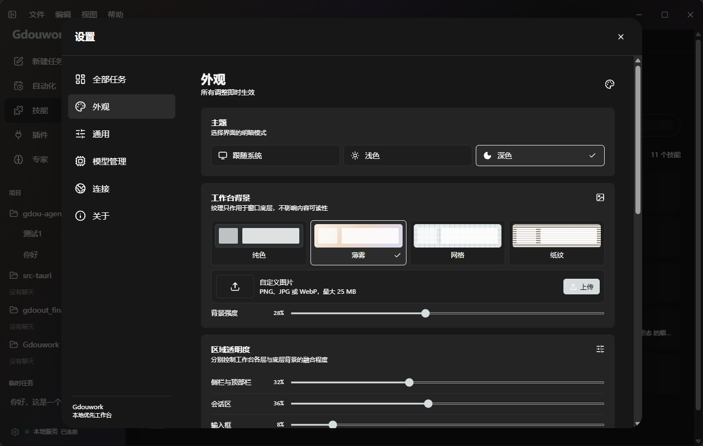

# Gdouwork

一个跑在你自己机器上的桌面 agent，基于 [pi](https://pi.dev) 内核
（`pi-ai` + `pi-agent-core` + `pi-coding-agent`）。

API key 自己提供、存在本机（`~/.gdou-agent/auth.json`），对话记录和文件也留在本机，
所以不存在「我们替你保存对话」这回事。

**但消息内容会发给你自己选的那个服务商** —— 那就是模型本身，这一步是它的工作方式，
不是额外的上报或中转。除此之外没有任何第三方服务器参与。

> 想真正开始对话，得先在界面上填一把 key：侧栏 **设置**（`Ctrl+5`）→ 找到你的服务商 → 粘贴 → 保存。
> 不填的话，应用能打开、能浏览，但每次启动会话都会告诉你「No model available」。



## 它能做什么

- **对话** —— 流式输出、可折叠的工具调用卡片、中断、markdown 渲染
- **改文件** —— 读写编辑、搜索、执行命令，每个变更行显示 `+N −M`
- **联网** —— 抓网页正文、搜索（Brave / Tavily）
- **交付产物** —— agent 显式把文件交给你，界面里直接预览（HTML 活预览 / 图片 / 文本）
- **专家** —— 用 markdown 写一个人格，附在会话上（随包三个示例）
- **技能** —— 一个目录（`SKILL.md` + 可选 `references/`）就是一段可复用流程，**按需加载**：会话里只挂名字和一句话描述，任务匹配了模型才调 `load_skill` 读正文（随包 18 个常用技能：提交、写 README、翻译、安全审查、API 设计、数据库、容器、性能优化、写 PR 描述等）
- **源代码管理** —— 对话中的变更实时展示 `+N −M`，右侧「源代码管理」页可暂存 / 取消暂存 / 丢弃 / 提交（带真实 git 支持）
- **用量统计** —— 每次对话结束把真实 token 用量与费用记录到本机，用量页提供总览、按模型、按日期，以及**月度预算**进度与超支提醒
- **记忆系统** —— 对话结束后自动提炼关于你的事实（称呼、语言、偏好、项目）写入本机，新会话自动注入，跨对话记得你；记忆页可查看 / 编辑 / 删除 / 手动添加
- **自动化（定时任务）** —— 配置好配方与触发时间，桥运行期间按计划自动执行
- **自动更新** —— 应用内一键检查并升级（配合 GitHub release 发布签名更新包）
- **子代理** —— `delegate` 工具把一个自包含子任务交给独立上下文的子代理跑完，只把结论拿回来；子代理不能再生子代理，可用更便宜的模型跑
- **模式** —— 决定 agent 怎么做，同样是一个 markdown 文件。随包 `general`（日常任务优先）与 `coding`（仓库开发），自己加一个 = 加一个文件。两个模式工具集相同（都能读写文件、跑命令），区别在**提示词风格**
- **模型与凭据** —— 界面上直接填 key（侧栏「设置」，`Ctrl+5`），编写器右下角点模型名就在已配置的服务商之间切换；key 只以掩码显示，没有「读回我的 key」这个通道
- **扛得住** —— 连着重复的同一次调用会被拦下并告知模型；provider 在产出内容前挂掉会自动换到备用模型

三种入口共用同一个内核：无界面 CLI、终端 TUI、桌面工作台（Gdouwork，Vue3 前端 + 本地桥）。
桌面工作台是当前的主 GUI（2026-09 起，取代了此前的 Electron 桌面版，后者仍保留在
`electron/` + `renderer/`，可继续用 `npm run gui` 打开）。

## 三条承重的设计决定

**专家只能收窄工具集，不能扩大。** 专家是用户自己写的 markdown 文件。
如果它能加工具，「装个专家」就等于「装个后门」——一个第三方专家包能把 `general`
的文件访问打开。所以工具集是**交集**：`模式的工具 ∩ 专家的允许集`。

**权限门的主轴是路径归属，不是工具种类。** 同一个 `write` 写工作目录内是日常操作，
写 `~/.ssh` 不是。判定链是**有序**的，靠后的阶段不能放行靠前已拒的——
所以 `danger-full-access` 档位下读凭据文件仍然被拒，因为档位在第 4 阶段才被查询，
而凭据在第 1 阶段已经返回了。

**命令检查器是黑名单，不是沙箱。** 它拦住那些能绕开所有路径保护的命令形态
（读凭据、下载即执行、编码执行、反弹 shell、工作目录外的递归删除），
**但它提高门槛，不建立边界**——一个坚决的模型能写出不匹配任何模式的等价形式。
真正的边界是 OS 级的，那是另一件事。文档里如实标注了这一点。

> pi 本身没有任何路径约束——它的 `resolvePath` 对绝对路径直接放行。
> 上面这些是这个项目**加上去**的，不是继承来的。

## 界面

| 交付产物 + 预览 | 深色主题 |
| --- | --- |
|  |  |

| 技能 | 设置 |
| --- | --- |
|  |  |

更多截图（含变更追踪、工具分组、打包后的实际界面）在
[`docs/screenshots/`](docs/screenshots)。

## 文档

| 文档 | 内容 |
| --- | --- |
| [`FEATURES.md`](FEATURES.md) | 功能清单：加了什么、怎么实现的、**以及踩过的坑** |
| [`docs/workbuddy对齐清单.md`](docs/workbuddy对齐清单.md) | 差距账目：对标 WorkBuddy 的 15 类能力逐条列出，含优先级 |
| [`docs/state-and-migration.md`](docs/state-and-migration.md) | 状态文件在哪、怎么换机器 |
| [`DESIGN.md`](DESIGN.md) | 待做功能的设计方案（讨论稿，含需要拍板的问题） |

`FEATURES.md` 里「踩过的坑」那几节大概是这份文档里最有价值的部分——
每个坑都写了**为什么当时会判断错**，而不只是结论。

## 更新日志

> 每次发布都在这里追加一节，写清「这个版本新增 / 修复 / 变更了什么」。

### v0.1.16（2026-09-26）

**新增**

- **Git 提交流程落地**：源代码管理页真正可用——暂存 / 取消暂存 / 丢弃 / 提交 / 回滚，
  改动列表显示真实的 `+N −M` 与「已暂存 / 未暂存」分组，提交图谱支持分页加载。
- **自动更新**：应用内一键检查并升级；发布流程支持签名更新包（`latest.json` + minisig）。
- **会话移动到项目**：会话操作菜单可把对话移到任意项目下，归属随之刷新。
- **导出对话**：会话菜单「导出对话」把完整对话导出为 Markdown 文件。
- **内置技能扩充到 18 个**：新增翻译、安全审查、API 设计、数据库、容器、性能优化、
  写 PR 描述等常用技能，随软件直接可用。
- **用量月度预算**：用量页可设置月度预算，进度条显示已用比例，超支红色提醒。
- **思考过程 UI 优化**：展开思考内容不再与正文重叠，思考区独立标签 + 独立容器。

**修复**

- 侧栏搜索按钮被顶部栏遮挡 —— 下移。
- 记忆页来源标签显示原始英文键名 —— 修复为「自动提炼 / 手动添加」，并按最新排序。
- vue-tsc 类型错误从 60+ 清零（删除未接入的死代码、重建协议类型）。

## 快速开始

```bash
# 1. 装依赖。pi 的源码已经在 vendor/pi 里，不需要任何外部 checkout
npm install

# 2. 选一家 provider，设置对应的 key（任选其一）
export DEEPSEEK_API_KEY=sk-...        # DeepSeek
export MOONSHOT_API_KEY=sk-...        # Moonshot / Kimi
export ZAI_API_KEY=...                # 智谱 GLM
export QWEN_TOKEN_PLAN_API_KEY=...    # 通义 Qwen

# 3. 验证接线是否正确（不消耗额度）
npm run check

# 4. 检查环境和凭据状态
npm run run -- --doctor

# 5. 启动交互界面（会先问你用哪个模式）
npm run run

# 6. 或者直接无界面跑
npm run run -- -p general "what is the time in Tokyo?"
npm run run -- -p coding "summarize this repository"

# 7. 桌面工作台（一键起「本地桥 + 前端」，然后浏览器打开 http://127.0.0.1:5173）
npm run dev:shell
```

想要**联网搜索**的话再加一个搜索服务商的 key（`web_fetch` 不需要）：

```bash
export BRAVE_API_KEY=...    # 或 TAVILY_API_KEY=...
```

搜索 key 走环境变量而不是写进配置文件，这是有意的：权限门**允许工具读**程序配置
（只拦写），所以存在那里的 key 会被模型调用的任何工具读到。

PowerShell 里设置 key 的写法是 `$env:DEEPSEEK_API_KEY="sk-..."`。

## TUI 界面

在交互式终端里不带 prompt 启动，就会进入对话界面。

```
Gdouwork  built on the pi kernel

ctrl+o last tool · ctrl+t all tools · ctrl+l clear · ctrl+c exit · enter send · shift+enter newline

› summarize the changes in src/kernel

⏺ read src/kernel/agent.ts
  │ import { Agent, type AgentMessage } from "@earendil-works/pi-agent-core";
  │ ...
  └ … 148 more · 154 lines total · ctrl+o to expand

The session is assembled in one place. `createAgent` resolves the runtime,
asks the profile for its prompt and tools, and returns an `AgentSession`…

TUI probe · deepseek/deepseek-flash · C:\Users\Na1aB\Desktop\gdou-agent
```

> 上面这段是程序实际输出的原文，所以界面文字目前是英文。如果需要把界面本身
> 汉化，那是另一处改动（`src/tui/` 里的字面量），跟本文档的语言无关。

| 按键 | 行为 |
|---|---|
| `enter` | 发送 |
| `shift+enter` / `ctrl+j` | 换行 |
| `ctrl+o` | 展开或折叠最近一次工具调用 |
| `ctrl+t` | 展开或折叠全部工具调用 |
| `ctrl+l` | 清空 transcript |
| `ctrl+c` | 中止当前这一轮；再按一次退出 |
| `ctrl+d` | 输入为空时退出 |

四个设计决定：

**用主屏，不用备用屏。** transcript 落在终端自己的 scrollback 里，所以原生滚动、
搜索、复制全都能用。备用屏会拿这三样换一个固定视口——对一个输出要被复制走的助手
来说，这是错的取舍。

**工具输出默认折叠。** 一次 `read` 读大文件、或者一次 `bash` 调用，都可能吐几百行；
铺开就把答案埋了。折叠视图显示的是**尾部**而不是头部，因为错误出现在输出末尾。

**工具运行期间输出是流式的。** 长命令会显示进度，而不是卡住不动。更新通过
`tool_update` 事件送达——这也是为什么归一化层要把部分结果和最终结果分开表达。

**渲染只依赖 `AgentEvent`。** 没有任何视图 import pi 的类型，所以 pi 可以在底层
升级而不波及表现层。

### TUI 目录

```
src/tui/
  index.ts                    入口：TTY 检查、模式选择器、交接
  app.ts                      订阅路由、按键、生命周期
  theme.ts                    窄 token 集；深色与浅色
  components/
    transcript.ts             有界条目列表；工具视图记账
    tool-call.ts              可折叠的工具调用，带实时输出
    messages.ts               用户轮与助手轮
    notice.ts                 横幅、错误、预着色文本块
    status-line.ts            模式、模型、工作目录、瞬时提示
    profile-picker.ts         启动时的模式选择
```

## 桌面工作台（Gdouwork）

```bash
# 一键起「本地桥 + 前端」（Ctrl+C 同时停两个）
npm run dev:shell
# 然后浏览器打开 http://127.0.0.1:5173
```

**Gdouwork 由两部分组成**：`shell/` 是一个自绘的 Vue3 工作台（Vite 开发服务器，
端口 5173），`bridge/server.ts` 是一个本地桥（端口 7438，JSON-RPC 2.0 over
WebSocket），把同一个 pi 内核包成前端能调的服务。前端**不碰内核代码**，它只跟桥说
话——这跟老 Electron 版「内核跑在主进程里」是两种接法，内核本身一行没改。

`npm run dev:shell` 会把桥和前端一起拉起来，**别只起其中一个**：桥没起的话，前端
只会显示「本地服务未连接」，看不出真正原因。桥已被占用时它会直接复用（不会起第二个）。

**桥重启不会丢会话**。每个会话落盘在 `~/.gdou-agent/sessions/`（对话跑完即存），
桥一重启，前端再往某个会话发消息，桥会**自动从磁盘重建**它再跑——用当前配置重建，
所以刚保存的 key 对旧会话也立即生效。前端只需刷新页面（或随便点一下导航）即可重连。

想真正开始对话，先在侧栏 **设置** 里填一把 key（保存后编辑框显示「留空保持不变」，
key 只以掩码展示）。没有 key 时前端仍能浏览界面，桥会自动走脚本化演示传输。

#### 方式二：Tauri 原生窗口（无需浏览器）

同一份 shell 也可以跑进一个 Tauri 原生窗口（`shell/src-tauri/`），桥作为后台进程
由 Rust 壳拉起，不再依赖浏览器：

```bash
cd shell
npm run dev:desktop      # 原生窗口 + 自动起桥（开发）
npm run build:desktop    # 出安装包（release）
```

开发时前端代码仍走 Vite 热更新，改完即见、**不用重新打包**；只有改了 Rust 壳或要出
安装包时才需要完整构建。Tauri 壳是「极薄」的——它只开窗口 + 管理桥的生命周期，前端
依旧通过 WebSocket 直连本地桥，断线重连逻辑与浏览器方式完全一致。

### 旧 Electron 桌面版（可选）

`electron/` + `renderer/` 是 2026-09 之前的桌面 GUI，仍可用：

```bash
# 起窗口（会先自动构建）
npm run gui
# 出安装包 → release/GDOU-agent-0.1.0-setup.exe
npm run package
```

它的启动坑和打包细节（`ELECTRON_RUN_AS_NODE` 环境泄漏、镜像下载、快捷方式指向）见
`FEATURES.md` §4。新工作台就绪后，这部分主要留给需要 exe 安装包的场景。

### 界面

外壳是自绘的工作台：标题栏 + 侧栏 + 主区，右侧是可拖拽宽度的检查器，深浅两套主题（首次跟随系统，手动切换后记住）。侧栏宽度可拖拽调节并记住。

```
标题栏   窗口标记 · 菜单 · 拖拽区 · 窗口控制
侧栏     品牌区（logo + Beta）· 新建任务 · 自动化 / 技能 · 会话列表 · 设置
主区     当前会话 · 时间线（居中）· 检查器
         输入框（Enter 发送 / Shift+Enter 换行，可中止；模型切换在右下角）
```

截图在 [`docs/screenshots/`](docs/screenshots)。

**检查器**显示当前会话（模式/专家/模型/工具数/工作目录）、上下文占用（条 + 字符数 +
进度条）、以及**这个会话实际能用的工具名**。最后一项是重点：专家会收窄工具集，而
"工具不见了"和"专家没生效"从外面看是一样的。交付的产物也在检查器里预览/打开。

**技能页**列出可用的技能（名字 / 描述 / 触发条件 / 参考文件），支持安装/卸载/启停。
**自动化页**是诚实的待做页——说明会怎么做、以及已经定下的约束，而不是留一个读起来
像坏了的空白页。**新建任务**开一段新对话，历史会话点一下即恢复。

快捷键：`Ctrl+5` 打开设置，`Ctrl+B` 收侧栏。

**一次只跑一个会话。** 切换模式或专家会拆掉旧会话，而不是同时跑两个：配方决定系统提示和工具集，同时跑两个意味着这段对话不再描述同一个 agent。

### 对话会留下来

关掉窗口不再等于丢掉对话，开一个新话题也不再冲掉上一段。一段对话一个文件，存在
`~/.gdou-agent/sessions/`。启动时默认进**新的空对话**——历史不会自己跳出来挡在眼前，
但它就在左下角（或右上角）的历史列表里，点一下即恢复，状态行会标出恢复了多少条消息。

右上角的「历史」列出所有对话——标题取自每段的第一条用户消息，带相对时间和消息条数——
点一条切过去，点「改名」改标题，点 × 删掉。「新对话」开始新的一段，**旧的那段留在列表里**。

改名是行内编辑：Enter 提交、Escape 取消、失焦也提交。**空标题会被忽略**——清空会留下一行
没东西可点的记录，而且派生标题再也拿不回来了。改名只换标签，消息一条不少。

**模式仍然是恢复时的约束**：一段 coding 对话在 general 模式下打不开，因为模式决定系统提示
和工具集，恢复出来会是一段这个 agent 从未产出过的记录。

每个文件是**两行 JSON**：

```
{"id":...,"title":...,"updatedAt":...,"messageCount":...}
{"version":1,...,"messages":[...]}
```

第一行是摘要。列会话表只读这一行，所以列出很长的对话不等于把每段对话整个读进来——一段工具
输出里带着文件内容的记录可以到几 MB，而列表是随手点开的。

恢复的做法是把历史**转成事件**再交给界面，而不是把原始消息直接丢过去：

```
存储的 messages  →  replay()  →  AgentEvent[]  →  渲染层
```

这样"实时运行"和"恢复历史"共用同一条渲染路径，不会随着界面演进而漂移。代价是事件词表里多了一个
`user_message`——实时运行不发它（前端自己加气泡，这样即使运行根本没启动，你的消息也还在），
只有回放会发。

写入用临时文件加 rename，所以中断的写入不会在下次启动时变成半截文件。文件损坏或版本不符时会被
移到一边（`.corrupt`）而不是删掉。早期版本用的是「每个模式一份滚动会话」，启动时会自动迁移过来。

### 长对话会被裁剪（但记录不会）

每轮请求都会把整段消息列表发给模型，所以一段很长的对话最终会撞上 provider 的上下文上限。
pi 的简单 `Agent` 不做压缩，但留了 `transformContext` 这个接缝——它的文档注释点名用途就是
"pruning old messages"，而且它作用在发给模型的那一份上，`state.messages` 不受影响。

所以：

```
state.messages      →  完整记录（界面显示、落盘）—— 不动
transformContext    →  只改发给模型的那一份 —— 裁剪在这里
```

**你能往上翻的对话始终是完整的**，而模型被要求考虑的部分有上界（默认 1 MB 序列化字符，
远低于任何目标模型的窗口）。

裁剪点**只能落在用户消息之前**。这是唯一安全的位置——落在别处会出现没有对应调用的工具结果，
provider 会直接判为畸形对话。找不到安全裁点时宁可不裁。

**代价要说清楚：模型是真的忘了。** 旧轮次不是被摘要，而是从它的视野里消失。所以屏幕上的记录
和模型的工作集不是一回事。`npm run run -- --doctor` 会打印这个上限。

因为裁剪在构造上不可见，**跨越预算时界面上会出现一条提示**：

```
对话已超出上下文上限，模型现在只能看到最近 N 条消息。上面的记录不受影响，仍然完整。
```

只在跨越的那一次出现，不是每轮都刷。它刻意不按错误样式呈现——这不是故障，标红只会让人学会忽略它。

**还有一个常驻指示器**：裁剪生效时状态行会追加 `· 模型可见 2/6 条`。

```
general · deepseek/deepseek-flash · 15 个工具 · 模型可见 2/6 条
```

它**只在真的裁剪时出现**——一个常驻的徽标会变成家具，而家具不会被阅读。它报的是**上一次请求模型实际看到了什么**，不是"下一次会发什么"：后者看起来更自然，但会因为裁剪在预算过小时切换状态而和刚显示的提示自相矛盾。

`GDOU_CONTEXT_BUDGET` 可以覆盖预算（字符数），用上下文窗口小的模型时可以压低。

### 工作目录

状态行右侧显示当前工作目录，点击可以换。选择会存进 `settings.json`，下次启动沿用。

默认值**不是** `process.cwd()`：打包后的应用从开始菜单启动，进程目录是 shell 恰好所在的位置，对一个要读写文件的工具来说那不是个有意义的答案。默认取用户主目录——一个可预测的目录好过一个随机的目录。

换目录会按新目录重建会话（对话历史会重新画出来，不会丢）。选到不是目录的路径会被拒绝，并保持原目录不变。

### 没有 API key 也能看到界面

**装上之后直接就能用**：没有凭据时启动会话会失败，错误下面会出现一个「用脚本化运行预览」按钮。点它就能跑一轮——流式文本、一次真实的工具调用、收尾文本，状态行会标明「脚本化运行」。

预览**从空白开始**（不接在真实对话后面），并且**不写进历史**——它是演示，不是对话。

开发时也可以直接用环境变量：

```bash
# macOS / Linux
GDOU_SCRIPTED_RUN=1 npm run gui

# Windows PowerShell
$env:GDOU_SCRIPTED_RUN=1; npm run gui
```

两者用的是同一个传输，但只有按钮触发的那次算「预览」——环境变量是开发者开关，它的运行是普通会话，会正常落盘。

它同时也是一处**测试接缝**：`check:gui` 的对话流程断言就跑在它上面，不需要 key、不需要网络。GUI 里只在运行期间存在的那些部分（文本流式进入、工具调用出现并填入输出）是最容易静默坏掉的，而这个模式让它们每次都被真实走一遍。

### 构建产物是 CommonJS

`npm run build` 产出 `dist/main.cjs`、`dist/preload.cjs`、`dist/cli.cjs`，全部是 CJS。

不是偏好，是踩出来的：Electron 把 `electron` 模块当 CJS 交给 ESM 加载器，命名导出靠静态分析合成，而**在 bundle 里这个合成不可靠**——`import { BrowserWindow } from "electron"` 会在链接期直接抛错，且成不成功取决于 bundle 里还有什么别的东西。`require("electron")` 不涉及互操作，永远可用。

CJS 缺的只有 `import.meta.url`（本项目 `paths.ts` 和 pi 的 `config.ts` 都在模块顶层用它），构建脚本用 `define` + banner 把它还原成真实文件 URL。这个 banner **不能加给 preload**：preload 跑在沙箱渲染进程里，那里的 `require` 加载不到 `node:url`，加了会让 preload 静默失效。

渲染进程同样**刻意零构建**：它是一个没有 import 的经典脚本，所以能从 `file://` 直接加载。ES module 的 import 在 `file://` 下不工作（Chromium 会拦），这就是它没被拆成模块的原因。

### 状态隔离

pi 的 coding 工具（`grep` / `find`）会调用 ripgrep 和 fd，由 pi 在首次使用时下载。下载位置默认是 `~/.pi/agent/bin`——**pi 自己的目录**。本项目通过 `package.json` 里的 `piConfig` 把它挪到 `~/.gdou-agent/agent/bin`：

```json
"piConfig": { "name": "gdou", "configDir": ".gdou-agent" }
```

`npm run run -- --doctor` 会把 `tool bin dir` 和 rg/fd 是否就位打出来（它会真的执行这两个二进制，因为"文件在"和"能跑"是两回事）。GUI 自检也会断言这个目录必须落在自己的 home 下——因为搞错了不会报任何错，只是文件出现在不该出现的地方。

### 随包分发 rg / fd

目录隔离解决了"放错地方"，但没解决"根本没有"。pi 是**首次使用时联网下载** rg 和 fd 的，所以一台没有外网的机器上，`grep` 和 `find` 会静默失效——用户看到的是"搜不出东西"，不是报错。

`npm run fetch:tools` 按固定版本抓取并校验（ripgrep 15.0.0、fd 10.5.0），`npm run package` 会自动带上它。二进制经 `extraResources` 放在 asar **外面**（要执行的东西不能放在归档里），应用首启把它们复制进 `~/.gdou-agent/agent/bin`，之后 pi 直接使用、不再下载。

下载优先走 `curl`：Node 内置的 fetch 不读 `HTTP(S)_PROXY`，在必须走代理的环境里只会给一个不说明原因的 `fetch failed`。

如果这台机器完全访问不到 GitHub，指向一个已经有这些二进制的目录即可（版本仍会校验）：

```bash
GDOU_TOOLS_SOURCE=/path/to/existing/bin npm run fetch:tools
```

### 打包要设镜像

`electron-builder` 和 `@electron/get` 默认从 GitHub releases 拉二进制（Electron 本体 120 MB、NSIS 工具链）。国内网络下这一步会失败，而且**报错具有误导性**——表面是 `502 Bad Gateway`，实际是本地代理拒绝转发：

```bash
export ELECTRON_MIRROR="https://mirrors.huaweicloud.com/electron/"
export ELECTRON_BUILDER_BINARIES_MIRROR="https://mirrors.huaweicloud.com/electron-builder-binaries/"
npm run package
```

两个都要设。只设后者是不够的，`electron-builder` 会独立再下一次 Electron。

另外注意：`npm install electron` 的安装脚本失败**不会**让 install 整体失败——`node_modules/electron/` 会装好，但 `dist/electron.exe` 不存在、`path.txt` 是空的。补跑一次 `node node_modules/electron/install.js` 即可。

安装包 118 MB（含随包的 ripgrep 与 fd），装完约 403 MB。绝大部分是 Chromium 和 Electron 运行时，内核那 5.4 MB 可以忽略。

## 项目结构

```
gdou-agent/
  bridge/
    server.ts           本地桥（7438）：把 pi 内核包成 JSON-RPC over WebSocket，
                        前端唯一能对话的地方；会话落盘 + 桥重启自动恢复
  shell/                Gdouwork 工作台（Vue3 + Vite）：自绘 UI，只跟桥说话
  electron/             旧 Electron 桌面版（可选）：主进程 + IPC，内核在这里面跑
    main.ts             主进程：窗口 + IPC
    preload.ts          唯一的桥（contextBridge，编译成 CJS）
  renderer/             旧 Electron 桌面版的渲染层（刻意零构建）
  scripts/
    dev-shell.mjs       一键起「桥 + shell」；桥被占用时直接复用
    vendor-pi.mjs       把 pi 的依赖闭包拷进 vendor/pi，并写 sha256 清单
    check-vendor.mjs    校验 vendor/pi 逐字节未改动
    sync-pi-paths.mjs   从 vendored pi 重新生成 tsconfig.pi-paths.json
    pi-env.mjs          开发态预加载：把 pi 的状态目录钉到本项目
    fetch-tools.mjs     按固定版本抓取 ripgrep / fd 到 vendor/bin
    build.mjs           esbuild 打包：main.cjs / preload.cjs / cli.cjs
    launch-gui.mjs      启动旧 Electron 桌面版
    package.mjs         跑 electron-builder，并把二进制下载指向镜像
    shortcut.mjs        把桌面快捷方式指向本项目里的构建
    smoke.ts            内核的离线自测
    tui-check.ts        TUI 的离线自测（假终端 + 脚本化模型）
    tool-check.ts       工具层的离线自测（真跑 grep / find / ls / read）
    gui-check.mjs       旧 GUI 自测（启动真应用，用 CDP 读回 DOM 断言）
    probe-*.mjs         桥的逐方法探针（真连 7438，带清理还原）
  src/
    cli.ts              无界面 CLI（事件流的参考消费者）
    index.ts            对外 API —— 只从这里 import
    paths.ts            文件系统布局（AGENT_HOME、vendored pi 位置）
    config/
      providers.ts      provider 预设：环境变量、默认模型
      settings.ts       settings.json 读写
    kernel/
      runtime.ts        Models 集合 + model spec 解析
      recipe.ts         组合模型：会话 = 模式 + 专家，专家只能收窄工具集
      events.ts         归一化后的 AgentEvent 词表（pi 事件 -> 自己的）+ 历史回放
      context.ts        上下文裁剪：只裁发给模型的，不动记录
      changes.ts        变更追踪：write/edit 的 +N −M（write 靠调用前快照）
      agent.ts          全项目唯一构造 pi Agent 的地方
      sessions.ts       会话落盘与恢复（一会话一文件，原子写）
      toolchain.ts      工具链目录 + 随包二进制投放
      demo.ts           脚本化运行：无凭据也能跑一轮
    definitions/
      frontmatter.ts    markdown frontmatter 解析（模式与专家共用）
      directory.ts      读一个目录里的 *.md 定义（模式与专家共用）
    experts/
      types.ts          Expert 契约
      builtin.ts        随包的三个示例专家（也是 markdown，走同一个解析器）
      registry.ts       三级加载：项目级 > 用户级 > 内置
    skills/
      types.ts          Skill 契约（正文 + references）
      builtin.ts        随包的两个示例技能
      registry.ts       三级加载（目录 + SKILL.md），渐进式披露的数据源
    profiles/           模式层（代码里仍沿用 profile 这个名字）
      types.ts          AgentProfile 契约
      builtin.ts        随包的 general / coding，内联 markdown
      loader.ts         markdown -> 模式（工具名在这里解析成工具）
      tool-catalog.ts   工具名 -> 工厂：一个模式文件能引用到哪些工具
      registry.ts       三级加载 + 编程注入，按 id 查找
    tools/
      time.ts           无状态示例工具
      notes.ts          有状态示例工具（自带存储）
      present.ts        产物交付：把文件交给界面显示
      net-guard.ts      URL 安全：拦回环 / 私网 / 云元数据 / 内嵌凭据
      web-fetch.ts      抓网页正文（readability + linkedom）
      web-search.ts     联网搜索（Brave / Tavily，需环境变量里的 key）
      load-skill.ts     按需读技能正文（渐进式披露的执行点）
    tui/                交互式前端（见上面「TUI 界面」）
    ui/
      style.ts          极简 ANSI 辅助函数
  dist/                 构建产物 —— 不要手改，由 npm run build 生成
  release/              安装包产物 —— 由 npm run package 生成
  vendor/pi/            vendored pi 源码（只读）+ manifest.json + README.md
  vendor/bin/           下载的 ripgrep / fd —— 由 npm run fetch:tools 生成
  electron-builder.yml  安装包配置
  FEATURES.md           在 pi 之上加了什么，以及怎么实现的
  tsconfig.json         项目配置
  tsconfig.pi-paths.json  自动生成 —— 不要手改
```

## 架构

三层，每一层都可以在不碰其他两层的前提下替换。前端在这三层之外：`shell/` 只通过
本地桥（`bridge/server.ts`，7438）跟 `AgentSession` 对话，桥是内核的前门，不重复任何
内核逻辑——会话持久化、模型解析、事件翻译都在桥或内核里，前端只有 UI。

**运行时**（`kernel/runtime.ts`）持有 `Models` 集合。pi-ai 自带 41 家 provider，
它们已经知道怎么从环境变量读 API key，所以这一层只负责把 `deepseek/deepseek-flash`
这样的 spec 解析成 `Model` 对象。

**模式**（`profiles/`）打包模式之间的差异：系统提示、工具集、执行偏好。
`AgentProfile` 接口只有三个方法宽。`general` 和 `coding` 现在工具集相同（都含文件、
命令、联网、交付工具），区别只在系统提示词引导的风格；工具取自 `pi-coding-agent`——
它们已经处理好了输出截断、文件变更排队、ripgrep 集成，重写一遍纯属浪费。

**内核**（`kernel/agent.ts`）是唯一构造 pi `Agent` 的地方。它解析运行时、向模式
索取提示和工具、把它们接起来，返回一个 `AgentSession`。这一层之上的所有代码
都只跟 `AgentSession` 打交道。

### 为什么要有事件归一化层

pi 的 `Agent` 发出的是一条为它自己的 TUI 定制的详细事件流。直接建立在这条流上的
前端，等于和 pi 的内部实现绑死。`kernel/events.ts` 定义了一套更小的词表——
`text_delta`、`tool_start`、`tool_end`、`run_end` 等等——并做翻译。TUI 只消费
`AgentEvent`，所以 pi 可以在底层升级而不必改表现层代码。

这一层已经回本了：provider 调用失败时，pi 的表达方式是一条带 `stopReason: "error"`
和 `errorMessage` 的 assistant 消息。只渲染 delta 的前端**完全看不到失败**。
把它提升成一个独立的 `error` 事件修掉了这个问题。

## 链接 pi 源码

pi 仓库没有 `dist`——它是纯源码仓库，而它的各个包在 `exports` 里指向 `./dist/*`。
所以 `@earendil-works/pi-ai` 这样的裸导入会解析失败。

pi 的源码**已经拷进本仓库**（`vendor/pi/`，6 个包、701 文件）。项目不依赖任何外部
checkout，克隆下来就能构建。`scripts/sync-pi-paths.mjs` 把 vendored 的
`compilerOptions.paths` 镜像进 `tsconfig.pi-paths.json`，并把每个 target 重写成指向
`vendor/pi/packages/*/src`。`tsx` 在运行时遵守这些 paths，`esbuild` 在构建时同样遵守。
结果就是零构建链接：改 vendored 源码，下次运行即生效。

`vendor/pi` 是**上游代码，必须逐字节不变**。`npm run check:vendor` 按
`vendor/pi/manifest.json` 里的 sha256 校验每个文件。要改行为就改 `src/`，或者用 pi
暴露的接缝替换它（`streamFn`、`transformContext`、`beforeToolCall` / `afterToolCall`、
`prepareNextTurn`）。细节见 `vendor/pi/README.md`。

升级 pi：

```bash
npm run vendor:pi -- --from <pi checkout>
npm run sync-paths
```

`GDOU_VENDOR_DIR` 可以指向别处的源码树。

三个值得知道的细节：

- pi 的 `"*": ["./*"]` 兜底规则被**刻意丢掉**了。它会把任意 specifier 映射到 pi
  仓库根目录，从而遮蔽第三方导入（`chalk` 会被解析成 `./vendor/pi/chalk`）。
- `paths` 的 target 必须以 `./` 开头，否则 tsgo 报 `TS5090`。
- `include` 覆盖了 pi 的 `*.d.ts` 声明补丁。pi 在
  `packages/coding-agent/src/utils/highlight-js.d.ts` 里声明了
  `highlight.js/lib/core.js` 这类模块；不带上的话，typecheck pi 源码会失败。

## 命令行

```
gdou-agent [options] [prompt]

  -p, --profile <id>       要运行的模式
  -e, --expert <id>        叠加在模式之上的专家
  -m, --model <spec>       模型，格式 provider/modelId
  -c, --cwd <path>         模式工具的工作目录
  -t, --thinking <level>   off | minimal | low | medium | high | xhigh | max
      --tui                强制打开交互界面
      --json               以 JSONL 输出归一化事件
      --list-profiles      列出可用模式
      --list-experts       列出可用专家及其工具收窄
      --list-providers     列出支持的 provider 及其环境变量
      --list-tools [id]    列出某个模式暴露的工具（可配 -e 看收窄后的结果）
      --doctor             环境、设置、配方、凭据状态
```

## 专家

一个有名字的方法论。存放在：

```
~/.gdou-agent/experts/<id>.md          用户级
<cwd>/.gdou-agent/experts/<id>.md      项目级，同名时优先
```

frontmatter 放元数据，正文就是提示词：

```markdown
---
name: 安全审计
description: 按攻击面审查代码，只读，不修改任何文件
tools: [read, grep, find, ls]        # 可选，只能收窄
thinkingLevel: high                   # 可选
---

你是一名安全审计员。审查时按以下顺序……
```

`tools` 是**允许集**，会和模式的工具取**交集**——它永远不会让 agent 多拿到一个工具。
如果专家要的工具这个模式没有，`--list-tools -e <id>`、`--doctor`、状态行都会说出来，
因为这个情况看起来像"专家没生效"，而原因从外面看不见。

用 markdown 而不是代码，是因为用户要能自己写、能改、能分享。一个需要写 TypeScript 才能定制的
"专家"，实际使用者只有写这个项目的人。

## 技能

一段可复用的流程，和专家的区别在于**它默认不在上下文里**。一个技能是一个目录：

```
~/.gdou-agent/skills/<id>/SKILL.md          用户级
<cwd>/.gdou-agent/skills/<id>/SKILL.md      项目级，同名时优先
```

`SKILL.md` 的 frontmatter 放元数据，正文是方法论；`references/` 放可选参考文件：

```markdown
---
name: 提交改动
description: 把改动整理成一条清晰的 commit
when_to_use: 用户说"提交"或"推送"时          # 可选，路由提示
---

目标是**一次提交表达一件事**……

术语表见 references/glossary.md，需要时再读。
```

**渐进式披露**是它的全部价值：会话开始时，提示里只有每个技能的 `id` + `description` +
`when_to_use`（几十个技能加起来也就几十行）；模型判断任务匹配后，才调 `load_skill`
读正文。不这么做，几十个技能全文塞进系统提示就是几十万 token 的固定开销。

列出技能用 `--list-skills`。技能和专家、模式一样，是用户能自己写、能改、能分享的文件。

prompt 也可以从 stdin 来：`echo "explain closures" | gdou-agent -p general`。

不带 prompt 时会启动交互界面。`--json` 永远不会打开它，因为这个参数是脚本化契约。
传了 `-p` 则跳过启动时的模式选择器。

## 模式

模式决定 agent **能做什么**，专家决定它**怎么做**。两者正交，一个会话是二者的
组合（`SessionRecipe`），所以专家只能在模式允许的工具里做减法。

模式也是 markdown 文件，位置和专家平行：

```
~/.gdou-agent/modes/<id>.md          用户级
<cwd>/.gdou-agent/modes/<id>.md      项目级，同名时优先
```

```markdown
---
name: 审查
description: 只读审查改动，不修改任何文件
tools: [read, grep, find, ls]        # 必填
thinkingLevel: high                   # 可选
toolExecution: sequential             # 可选：parallel | sequential
model: deepseek/deepseek-v4-pro       # 可选，只是建议
---

你负责审查这次改动。先搞清楚它想做什么，再判断它做到了没有。
```

正文就是系统提示词。工作目录与当前时间由内核**追加**在正文之后——这两样是事实，
不是模式的观点，所以不该由写文件的人去记得。

`model` 是**建议，不是设置**，优先级最低：显式选项 > `settings.json` > 模式。
点名一个只在它上面才表现好的模型是有用的（长文摘要要大窗口），
但让一个用户可能没写过的文件**静默压过用户自己的选择**，是最快让人不再信任配置文件的办法。
spec 写错时会在会话启动那一刻报错，并且**点名模式和它来自哪个文件**：

```
fatal: Mode "broken" names a model that does not exist: deepseek/depseek-flash
  (from ~/.gdou-agent/modes/broken.md)
```

光一句 "Unknown model" 会把人支使去翻设置和环境变量，而那个 spec 住在一个完全不同的地方。

**`tools` 是必填的，而且只能填已知的工具名。** 工具的集合在
`src/profiles/tool-catalog.ts` 里，目前是 pi 的 `read` / `bash` / `edit` / `write` /
`grep` / `find` / `ls` / `powershell`，加上本项目的 `current_time` / `save_note` /
`list_notes` / `present_files` / `web_fetch` / `web_search`。

这里有一条**不夸大的边界**：「加一个模式 = 加一个文件」对**组合已有工具**的模式
成立；需要一个还不存在的工具的模式，仍然要写代码并登记进工具目录。
工具就是代码，而数据文件不能凭空提供代码。

顺带一提：内置的两个模式也是 markdown，走的是同一个解析器（`builtin.ts` 里是内联
字符串，因为 `scripts/build.mjs` 只拷 `renderer/`，`resources/` 不参与构建，
打包后会读不到）。内置与用户文件的格式因此不会各自漂移。

## 稳定性

两件「没人盯着的时候会出事」的事，各有一个开关，都在 `~/.gdou-agent/settings.json` 里。

### 重复调用守卫

模型有时候会认定某个工具调用就是答案，拿到不满意的结果之后**发出完全一样的一次调用**。
第二次和第一次没有任何差别，结果也不会有。默认连着 3 次之后拦下，理由作为一条 error
工具结果回给模型——**和别的工具结果出现在同一个位置**，所以它知道该换个办法。

```json
{ "loopRepeatLimit": 3 }
```

`0` 关掉它。规则故意是钝的，一个合法地轮询同一条命令、参数还一样的工作流会误触，
所以调高和关掉都要能不改代码做到。

**规则是「连续」不是「累计」**：连着重复 3 次是卡住；一次会话里总共出现 3 次通常只是干活
（跑测试、改代码、再跑测试）。代价是一个**已知盲区**——交替循环（读 A、读 B、读 A、读 B）
永远抓不到。

### 备用模型

一个 provider 过载，或者某个区域网络不好，整轮对话就跟着它一起死。配一个备用模型就多一层救援：

```json
{ "fallbackModel": "deepseek/deepseek-v4-pro" }
```

**只在「产出任何内容之前」失败时才切**。回复一旦开始流式输出，用户已经看到了——
静默换模型重来，要么重复那句话的开头，要么替换掉屏幕上的文字。所以第一个 token 之后的失败
原样报出来。切换发生时会发一条提示，并且当前模型与备用模型都显示在界面里
（GUI 检查器、TUI 状态行），因为**一个悄悄来自别的模型的回复，用户本该在使用之前就知道有可能**。

## 添加工具

把 schema 声明为具名 const，让 `params` 能被推断出来，然后用
`AgentTool<typeof schema>` 注解这个工具：

```ts
const schema = Type.Object({ city: Type.String() });

export const weatherTool: AgentTool<typeof schema, { tempC: number }> = {
  name: "weather",
  label: "Weather",
  description: "Look up current weather for a city.",
  parameters: schema,
  async execute(_toolCallId, params) {
    const tempC = await lookup(params.city);
    return { content: [{ type: "text", text: `${params.city}: ${tempC}C` }], details: { tempC } };
  },
};
```

如果改成注解 `AgentTool<any>`，`params` 会被拓宽成 `unknown`，`execute` 的签名
立刻 typecheck 不过。`src/tools/time.ts` 是一个完整的可参考例子。

写完还要在 `src/profiles/tool-catalog.ts` 里登记一个名字，模式文件才引用得到它。
需要工作目录的工具（pi 的那批）用工厂 `(cwd) => ...`，无状态的工具返回共享实例。

要在代码里造一个 markdown 表达不了的模式（比如工具是运行时才拼出来的），
用 `registerProfile()`；它排在所有来源之后，也就是优先级最高。

## 验证

```bash
npm run check:vendor # 离线：vendor/pi 的 701 个文件逐字节对上 manifest
npm run smoke        # 离线：模块解析、模式、工具、事件、设置
npm run check:tui    # 离线：选择器、transcript、实时工具输出、按键
npm run check:tools  # 离线：真跑 grep / find / ls / read 对固定夹具
npm run check:gui    # 需先 npm run build：启动真应用，用 CDP 读回 DOM 断言
npm run typecheck    # tsgo --noEmit，必须干净
```

`npm run check` 一次跑完除 GUI 之外的全部（GUI 要先构建）。

`smoke` 零成本，是改动内核或重新同步 pi paths 之后应该跑的东西。它会清理掉自己
产生的状态。除了模块解析、模式、工具、事件、设置之外，它还钉住了上下文裁剪：裁剪的
不变量（保留 system、裁点落在用户消息前、**不产生没有对应调用的工具结果**、保留的
每个工具调用都还带着它的结果、**预算小于一轮时仍然裁剪**、单轮无法裁剪时原样返回），
加上**超预算时发出一次提示**、提示不被重复、**`the transcript still holds everything`**
（证明裁剪确实没有动记录）、以及指示器的数字来源。

`check:tui` 通过一个脚本化的 provider 驱动真实的 agent 回合，并对到达终端的内容
做断言。它**不需要 TTY**：它注入一个记录写入的 `Terminal` 来代替真实的 stdio。
它证明了两件组件级测试做不到的事——事件从 pi 经过归一化层正确路由到了视图；
以及没有任何渲染行超出终端宽度（`TuiMainScreen` 在超宽时会抛异常，所以
「跑完没抛」本身就是断言）。

`check:tools` 验证 coding 模式的工具**真的能干活**。它建一个内容已知的临时目录，
然后真跑 `grep` / `find` / `ls` / `read` 并检查结果——不联网、不需要 API key。
为什么值得单独一层：这些工具自己不搜索，它们调用 ripgrep 和 fd，而 pi 默认是
首次使用时联网下载的。只断言"二进制存在"不够，一个截断的或架构不对的二进制
也会安静地待在那儿，直到有东西去执行它。所以它真跑。

`check:gui` 是 GUI 侧的同一套思路，也是覆盖最广的一条：它按用户的方式启动**真实的 app**
（`electron .`），用 Chrome DevTools 协议驱动**一轮对话、一次重启、一次换目录、一次多会话
往返、一次裁剪、一次改名、一次无凭据预览**——发消息、等运行结束、读回 DOM 断言、检查会话
落盘、关掉应用、重新启动、断言对话完整恢复、压低预算再发一轮并断言提示与指示器、换工作目录、
开新对话并断言旧对话仍在、再跑一轮、切回旧对话、删掉一条、**行内改名并断言新名落到了磁盘上的
摘要行**、**最后不带脚本化环境变量再启动一次，断言启动失败被如实报告、预览按钮出现、点进去
真能跑一轮、且预览没有写进历史**——然后打开诊断面板检查内核状态。

163 项检查覆盖：空状态与模式选择、用户消息逐字渲染、助手文本流式到达、工具调用出现并按名字
（另加 `smoke` 的 191 条离线断言，含 SSRF 逐例防护、权限判定链、变更摘要）
标注、工具产出真实输出、折叠与展开的交互、会话落盘与摘要行独立可用、跨重启恢复、工作目录切换
与持久化、多会话列表与标题、切换与删除、**改名（含空名被忽略）**、裁剪提示的渲染与措辞、
常驻指示器的数字、**专家切换（含状态行、工具数变化、"模式没有的工具"警告的出现与消失）**、
**外壳（窗口按钮、导航、侧栏会话列表、检查器的真实工具列表、主题切换与落盘、视图切换）**、
**产物交付（卡片渲染、检查器列出、点击真的打开预览、预览通道拒绝未交付的路径）**、
**工具分组（形成、折叠、展开后行真的可见）**、
无凭据时的预览入口、路径解析、工具链目录隔离、随包二进制就位、模型目录
加载、以及诊断探测的结果。

它跑在脚本化运行模式上，所以**不需要 API key，也不需要网络**；它跑在临时状态目录上，所以
**不会读到也不会毁掉你真实的对话**；它按用户的方式启动应用（而不是把断言塞进 Electron 里跑），
所以测的就是真正会发布的东西。

**它测不到的东西**：系统目录对话框。它是模态的，没有可脚本化的接口，所以逻辑被拆成
"只报告路径"和"采纳路径"两步，自检驱动后者。对话框本身需要你手动点一次。

想在没有有效 key 的情况下确认 provider 链路是通的，就设一个故意错误的 key，
看 API 是否拒绝它：

```bash
DEEPSEEK_API_KEY=sk-invalid npm run run -- -p general "hi"
# 预期输出：error: 401: {"message":"Authentication Fails..."}
```

拿到 401 就说明 provider 注册、model 解析、auth 查找、HTTP 全都正常，
唯一的问题是凭据不对。

## 状态目录

与 pi 自己的状态分开存放，两者可以共存：

| 路径 | 内容 |
|---|---|
| `~/.gdou-agent/settings.json` | 默认模式、模型、思考等级、工作目录、备用模型、重复调用上限 |
| `~/.gdou-agent/notes.json` | 草稿纸笔记 |
| `~/.gdou-agent/sessions/<id>.json` | 一段对话一个文件，两行 JSON（摘要 + 记录） |
| `~/.gdou-agent/experts/<id>.md` | 你自己写的专家 |
| `~/.gdou-agent/skills/<id>/` | 你自己写的技能（目录 + `SKILL.md` + 可选 `references/`） |
| `~/.gdou-agent/modes/<id>.md` | 你自己写的模式 |
| `~/.gdou-agent/agent/bin/` | 随包投放的 ripgrep 与 fd（pi 的目录，被 piConfig 挪到这里） |

用 `GDOU_AGENT_HOME` 覆盖前五个的位置。API key 不在这个目录里，见
`docs/state-and-migration.md`。

## 下一步

内核、CLI、TUI、桌面 GUI、对话界面、会话持久化与多会话（含改名）、工作目录选择、
上下文裁剪与告知、无凭据预览、安装包、专家、模式、技能（渐进式披露）、子代理、
重复调用守卫、备用模型、按模式选模型、观测（崩溃报告/日志/内存诊断）都已经可用。

**还没做的（按路线图）：**

1. **接真实 provider 跑一轮**。脚本化运行验证了转发逻辑对，但证明不了真实 provider 的错误形状对得上——真实 429 / 502 是备用模型真正要接住的东西。
2. **MCP 支持**。接一个 `@modelcontextprotocol/sdk`，能力面立刻扩大，是「用现成的」最典型落点；但它的安全面也最大，必须排在权限门之后（权限门已就位）。
3. **自动化项目**。它本身就是「配方 + 提示词 + 触发时机」，前两样现在都在了。按目前的决定：只做运行时触发，产出算单独一个概念。
